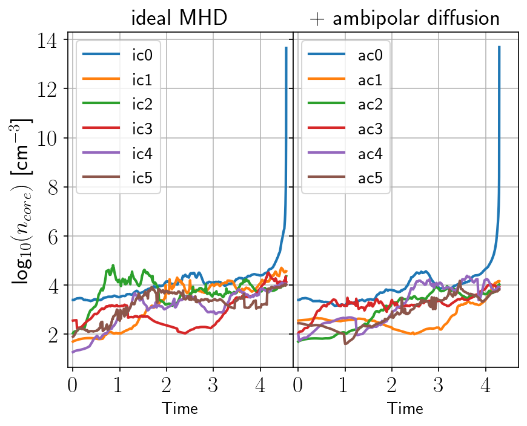
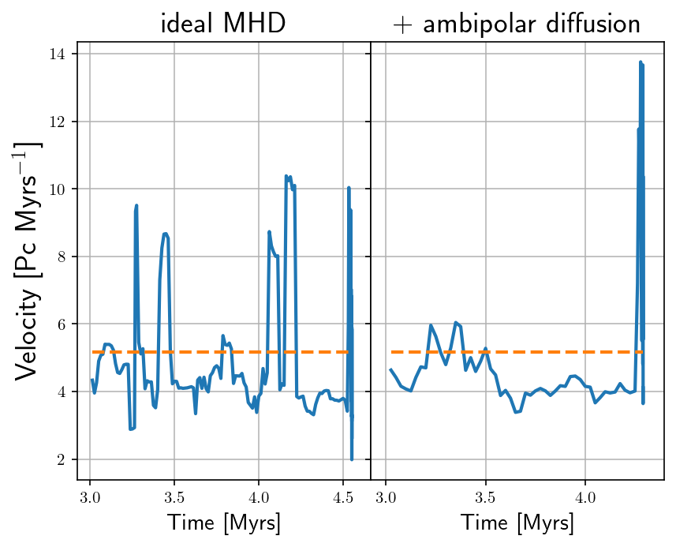
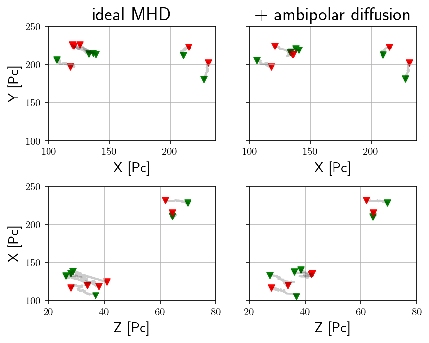
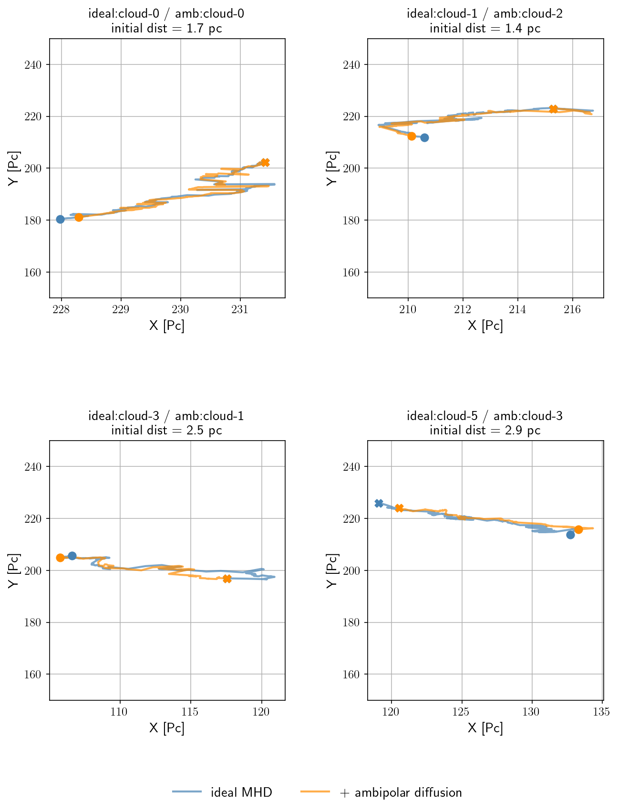

# Reduction Factor Report

## Main Cloud

  

We can observe only one of them, reaches densities higher than $10^5$.

  

And similarly, the clouds velocity through it's evolution, mantains a mean velocity around $5$ km s $^{-1}$

## Histories of Six Molecular Clouds

For the resto of the clouds, we can observe that they are selected almost, to the same regions in the box. Though it is understandable that the presence of ambipolar diffusion can cause their histories to diverge slightly. 

  

Unfortunately, once we attempt to match the one cloud to another, we find only four of their histories are a well enough match to affirm that they belong to the same cloud. We will focus on these four clouds.

  

